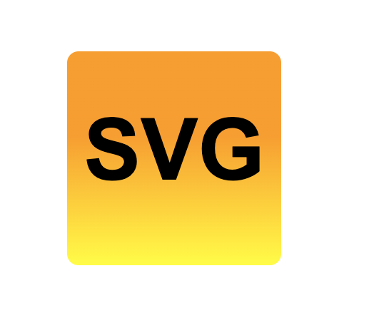

# svg-logo-maker

## Description

A command-line application that takes in user input and generates a logo

### Motivation

As a freelance web developer I want to generate a simple logo for my projects 

### Why?

so I don't have to pay a graphic designer

### Problem Solved

Quick and easy to use and free

## Installation

Follow these steps to set up and use the SVG Logo Maker on your local machine:

- git clone https://github.com/Kaystaken/svg-logo-maker.git
- npm install inquirer@8.2.4
- node index.js

## Usage

Run the app using node index.js.
Answer the prompts:
Choose a shape (square, circle, triangle).
Set the colour for the shape.
Choose if you want a 2-color gradient background.
If yes, enter the second colour for the gradient.
Enter up to three characters for the text.
Set the colour for the text.
Check out your created logo.svg in the demo folder.
Open logo.svg in a browser to see your logo.

video demo:
https://drive.google.com/file/d/114tPZhy0f7VgNESwdm4dWxzrhOqig69V/view?usp=sharing

demo logo: 

REPO link: https://github.com/Kaystaken/svg-logo-maker

## Credits

Bahar showed me the way to make shapes gradient. Previous lessons in UTOR bootcamp were also very helpful in creating this logo maker.

## License

Licensed under the MIT license